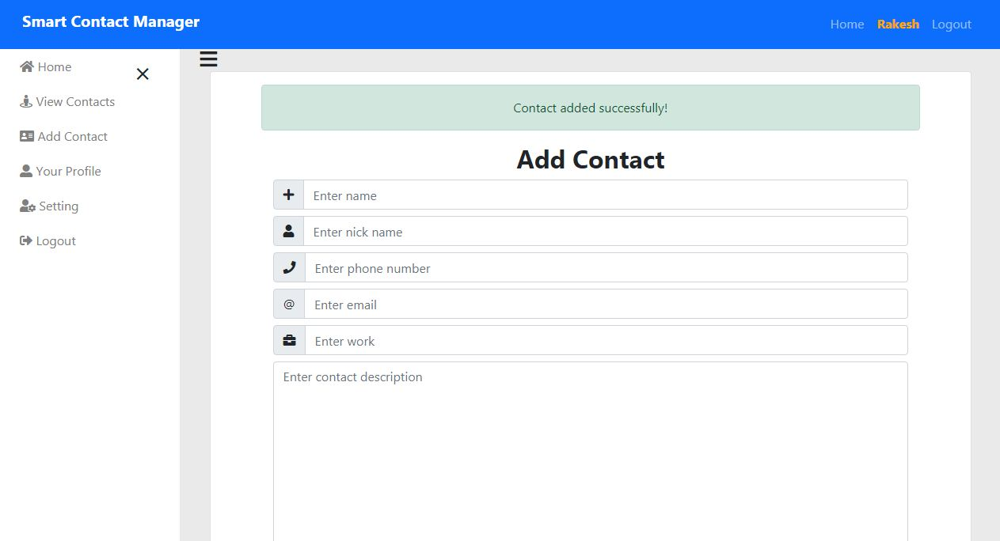

# SmartContactManager1 ScreenShort
<h3>Home Page<h3>
  
<h3>Resister User<h3>
  
  <h3>Resistered User<h3>
    
    <h3>Login User<h3>
    
     <h3>User Dashboard<h3>
    
       <h3>Add Contact<h3>
  
         <h3>Contact Added<h3>
  
           <h3>Contact List <h3>
  
               <h3>Contact Detail <h3>
  
                   <h3>Contact Update <h3>
  
                       <h3>Contact Delete <h3>
  
                           <h3>Contact Deleted <h3>
  
                               <h3>User  Logout<h3>
  
